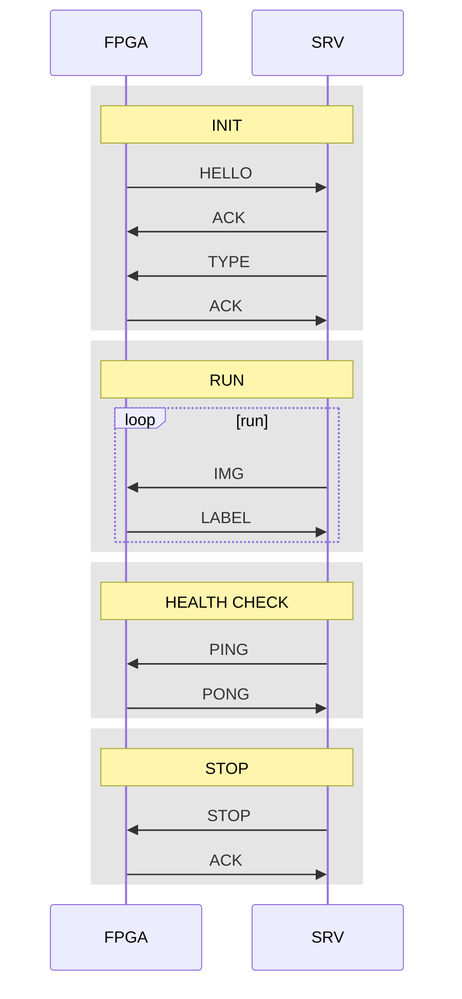
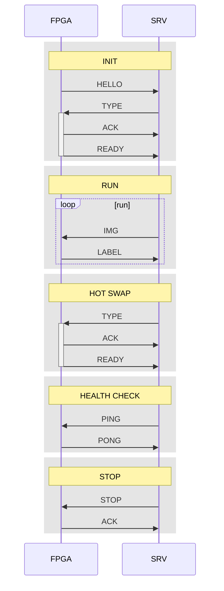

# COLD MODE

```mermaid
sequenceDiagram;
participant F as FPGA
participant S as SRV

rect rgba(0,0,0,.1)
Note over F,S: INIT
F->>S:HELLO
S->>F:ACK
S->>F:TYPE
F->>S:ACK
end

rect rgba(0,0,0,.1)
Note over F,S:RUN
Loop run
S->>F:IMG
F->>S:LABEL
end
end

rect rgba(0,0,0,.1)
Note over F,S:HEALTH CHECK
S->>F:PING
F->>S:PONG
end

rect rgba(0,0,0,.1)
Note over F,S:STOP
S->>F:STOP
F->>S:ACK
end
```
# HOT MODE

```mermaid
sequenceDiagram;
participant F as FPGA
participant S as SRV

rect rgba(0,0,0,.1)
Note over F,S: INIT
F->>S:HELLO
S->>+F:TYPE
F->>S:ACK
F->>-S:READY
end

rect rgba(0,0,0,.1)
Note over F,S:RUN
Loop run
S->>F:IMG
F->>S:LABEL
end
end

rect rgba(0,0,0,.1)
Note over F,S:HOT SWAP
S->>+F:TYPE
F->>S:ACK
F->>-S:READY
end

rect rgba(0,0,0,.1)
Note over F,S:HEALTH CHECK
S->>F:PING
F->>S:PONG
end

rect rgba(0,0,0,.1)
Note over F,S:STOP
S->>F:STOP
F->>S:ACK
end
```